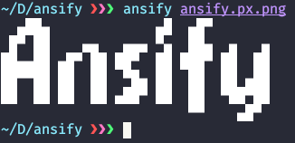
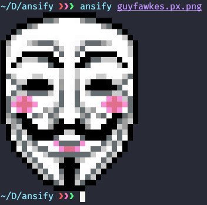

<div align="center">

<h1>image to ansi rgb escape sequence converter</h1>
</div>


## description

uses the unicode half block character `▄` to encode pixels from an image into text

one character from the output corresponds to two consecutive pixels from the image (on the y axis), the top one being the background of the character and the bottom one being the foreground


## examples

<table>
    <tr>
        <th> input file </th>
        <th> output screenshot </th>
    </tr>
    <tr>
        <td>  </td>
        <td>  </td>
    </tr>
    <tr>
      <td>  </td>
      <td>  </td>
    </tr>
    <tr>
      <td>  </td>
      <td>  </td>
    </tr>
    <tr>
      <td>  </td>
      <td>  </td>
    </tr>
</table>


## usage and options

- convert image.png using a local copy of the script
```bash
./ansify.sh image.png
```
- convert image.png using curl piping
```bash
curl -Ls roliboy.ml/ansify | bash -s image.png
```
- convert image.png and replace transparent pixels with a rgb value
```bash
./ansify.sh image.png -a 40,42,54
```


## dependencies and supported file types

the script uses `imagemagick` to convert images to raw pixel data, thus it supports every file format supported by imagemagick